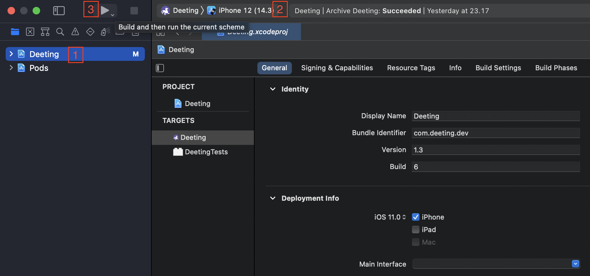
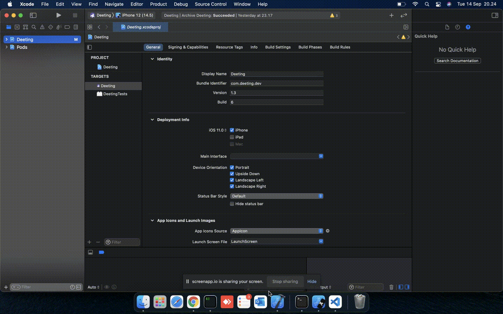

<!-- PROJECT LOGO -->
<br />
<p align="center">
  <a href="">
    
  </a>

  <h1 align="center">DEETING</h1>

  <p align="center">
    Easy video converence and chat messaging for website, desktop, and mobile (ios & android).
    <br />
    
  </p>
</p>

<br />


## Ios Installation

1. Clone the repository 
   ```git
   git clone https://github.com/17-Miles-LLC/Deeting-mobile.git
   ```
2. Install NPM packages
   ```sh
   npm install 
   ```
3. Install Pod in  `/ios` folder
   ```sh
   cd ios && pod install && cd ..
   ```
4. Start Metro
   ```sh
   npx react-native start
   ```
5. run emulator with terminal command:
   
   ```sh
   npx react-native run-ios
   ```
   or with Xcode
   <br />
   <br />
   
   <br />
   
   ## Ios Build
   